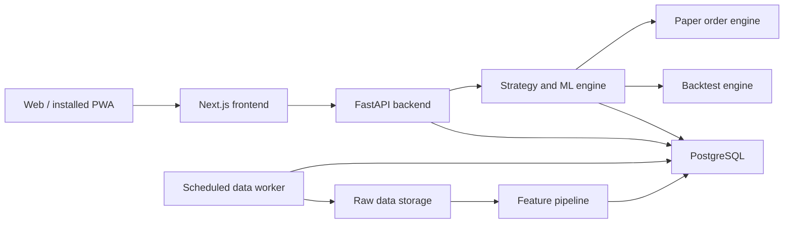
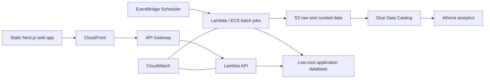
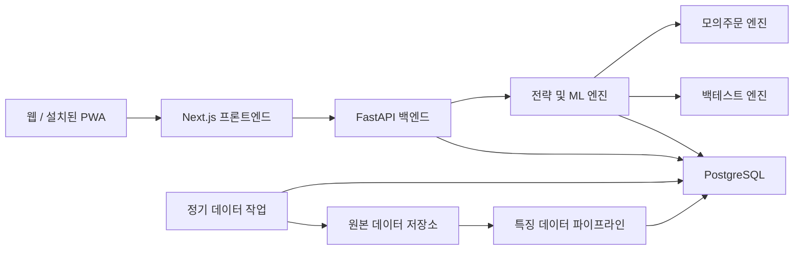
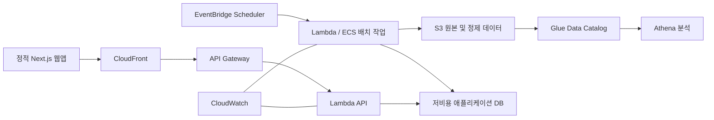
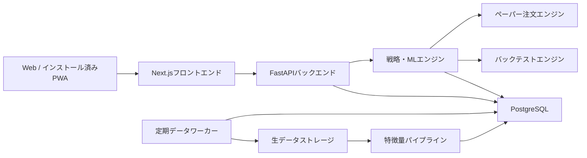
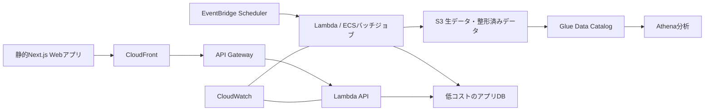

# Architecture

[English](#english) | [한국어](#한국어) | [日本語](#日本語)

<a id="english"></a>

> English version

## 1. Delivery strategy

MarketPilot starts as a modular monolith. Frontend, API, data jobs, and ML code
remain separate modules, but the local system stays simple enough to run with
Docker Compose. AWS services are introduced only after local behavior is
tested.

## 2. Local architecture



## 3. Planned repository structure

```text
MarketPilot/
├── apps/
│   ├── web/
│   └── api/
├── packages/
│   └── contracts/
├── services/
│   ├── data_pipeline/
│   ├── strategy_engine/
│   └── backtest_engine/
├── infrastructure/
│   └── terraform/
├── docs/
├── docker-compose.yml
└── README.md
```

This structure is a target, not work to create all at once.

## 4. Core domains

### Portfolio ledger

The source of truth for money movement:

- portfolio
- cash transaction
- order
- execution
- position snapshot
- valuation snapshot

Cash transactions use types such as `INITIAL_DEPOSIT`, `DEPOSIT`,
`WITHDRAWAL`, `FEE`, and `DIVIDEND`. Balances are derived from ledger events
instead of silently overwriting a seed-money field.

Portfolio accounting separates the portfolio base currency from the
instrument or quote currency. Executions should preserve the FX rate used at
fill time, while valuation uses the latest available FX rate from the market
data boundary. This prevents historical realized P/L from changing when a
newer FX rate arrives.

### Market data

- instrument metadata
- price bars
- quote provider boundary exposed through the backend API
- exchange calendars
- foreign-exchange rates
- corporate actions
- collection runs and quality checks

The frontend should request quotes from MarketPilot's backend instead of
calling third-party market-data APIs directly. This keeps secrets, provider
selection, caching, FX conversion, and valuation rules on the server side.
FX rates follow the same rule: screens request them through MarketPilot's
backend, and the backend decides source, cache, timestamp, and conversion
rules.

### Research data

- macroeconomic observations
- news articles and extracted events
- engineered features
- signals and risk scores
- model and strategy versions

### Experiment and trading

- backtest configuration
- backtest run and metrics
- paper account
- risk policy
- decision record
- paper order and execution

## 5. Signal contract

Each recommendation should follow a stable structure:

```json
{
  "symbol": "EXAMPLE",
  "as_of": "2026-06-18T00:00:00Z",
  "horizon_trading_days": 20,
  "direction": "bullish",
  "probability": 0.67,
  "risk_level": "high",
  "expected_return_range": [-0.062, 0.118],
  "evidence": ["positive momentum", "abnormal volume"],
  "counter_evidence": ["high realized volatility"],
  "strategy_version": "baseline-0.1.0"
}
```

The values above are illustrative, not a real recommendation.

## 6. AWS target architecture



The exact database and hosting choice will be decided after measuring the MVP.
RDS, NAT Gateway, always-on ECS, and persistent SageMaker endpoints are not
default choices because they can create idle cost.

## 7. Security and operational boundaries

- Secrets are never committed to Git.
- Paper and future live adapters use different credentials and interfaces.
- Jobs are idempotent and safe to retry.
- Data collection and model runs have traceable run IDs.
- Orders have unique client IDs to prevent duplicates.
- Risk rules execute outside the LLM.
- LLM output cannot directly place an order.
- Logs must avoid credentials and unnecessary personal data.

## 8. Testing approach

- unit tests for accounting, indicators, and risk rules
- integration tests for API and database behavior
- golden-data tests for backtest reproducibility
- data-quality tests for collection pipelines
- walk-forward validation for predictive models
- Playwright tests for primary user workflows

---

## 한국어

### 1. 개발 전략

MarketPilot은 모듈형 모놀리스로 시작합니다. 프론트엔드, API, 데이터 작업 및 ML
코드는 서로 다른 모듈로 분리하지만, 전체 로컬 시스템은 Docker Compose로 실행할 수
있도록 단순하게 유지합니다. AWS 서비스는 로컬 동작을 검증한 뒤 도입합니다.

### 2. 로컬 아키텍처



### 3. 예정 저장소 구조

```text
MarketPilot/
├── apps/
│   ├── web/
│   └── api/
├── packages/
│   └── contracts/
├── services/
│   ├── data_pipeline/
│   ├── strategy_engine/
│   └── backtest_engine/
├── infrastructure/
│   └── terraform/
├── docs/
├── docker-compose.yml
└── README.md
```

이 구조는 최종 목표이며 처음부터 모든 폴더를 한꺼번에 만들지는 않습니다.

### 4. 핵심 도메인

#### 포트폴리오 원장

자금 이동에 대한 단일 진실 공급원입니다.

- 포트폴리오
- 현금 거래
- 주문
- 체결
- 포지션 스냅샷
- 평가액 스냅샷

현금 거래는 `INITIAL_DEPOSIT`, `DEPOSIT`, `WITHDRAWAL`, `FEE`,
`DIVIDEND` 등의 유형을 사용합니다. 시드머니 필드를 덮어쓰지 않고 원장 이벤트를
기반으로 잔액을 계산합니다.

포트폴리오 회계에서는 포트폴리오 기준 통화와 종목 또는 현재가 통화를 분리합니다.
체결 기록에는 체결 시점에 사용한 환율을 저장하고, 현재 평가는 시장 데이터 경계에서
가져온 최신 환율을 사용합니다. 이렇게 해야 나중에 환율이 바뀌어도 이미 확정된
실현 손익이 흔들리지 않습니다.

#### 시장 데이터

- 종목 메타데이터
- 가격 봉
- 백엔드 API를 통해 노출되는 현재가 provider 경계
- 거래소 달력
- 환율
- 기업 활동
- 수집 실행 이력 및 품질 검사

프론트엔드는 외부 시장 데이터 API를 직접 호출하지 않고 MarketPilot 백엔드에 현재가를
요청합니다. 이렇게 하면 비밀값, 제공자 선택, 캐시, 환율 변환 및 평가 규칙을 서버
쪽에서 관리할 수 있습니다.
환율도 같은 규칙을 따릅니다. 화면은 MarketPilot 백엔드에 환율을 요청하고, 백엔드는
출처, 캐시, 수집 시각 및 변환 규칙을 결정합니다.

#### 연구 데이터

- 거시경제 관측값
- 뉴스 기사 및 추출 이벤트
- 가공된 특징 데이터
- 신호 및 위험 점수
- 모델 및 전략 버전

#### 실험 및 거래

- 백테스트 설정
- 백테스트 실행 및 지표
- 모의계좌
- 위험 정책
- 판단 기록
- 모의주문 및 체결

### 5. 신호 규격

각 추천 정보는 다음과 같은 안정적인 구조를 따릅니다.

```json
{
  "symbol": "EXAMPLE",
  "as_of": "2026-06-18T00:00:00Z",
  "horizon_trading_days": 20,
  "direction": "bullish",
  "probability": 0.67,
  "risk_level": "high",
  "expected_return_range": [-0.062, 0.118],
  "evidence": ["positive momentum", "abnormal volume"],
  "counter_evidence": ["high realized volatility"],
  "strategy_version": "baseline-0.1.0"
}
```

위 값은 구조를 설명하기 위한 예시이며 실제 투자 추천이 아닙니다.

### 6. AWS 목표 아키텍처



데이터베이스와 호스팅은 MVP를 측정한 뒤 최종 결정합니다. 유휴 비용이 발생할 수
있으므로 RDS, NAT Gateway, 상시 실행 ECS 및 영구 SageMaker 엔드포인트는
기본 선택으로 사용하지 않습니다.

### 7. 보안 및 운영 경계

- 비밀정보를 Git에 커밋하지 않는다.
- 모의거래와 향후 실거래에 서로 다른 인증정보와 인터페이스를 사용한다.
- 작업은 멱등성을 보장하고 안전하게 재시도할 수 있어야 한다.
- 데이터 수집 및 모델 실행에 추적 가능한 실행 ID를 부여한다.
- 중복 주문을 방지하기 위해 주문마다 고유 클라이언트 ID를 사용한다.
- 위험 규칙은 LLM 외부에서 실행한다.
- LLM 출력이 직접 주문을 실행하지 못하게 한다.
- 로그에 인증정보와 불필요한 개인정보를 기록하지 않는다.

### 8. 테스트 전략

- 회계, 지표 및 위험 규칙 단위 테스트
- API 및 데이터베이스 통합 테스트
- 백테스트 재현성을 위한 골든 데이터 테스트
- 수집 파이프라인 데이터 품질 테스트
- 예측 모델 워크포워드 검증
- 주요 사용자 흐름 Playwright 테스트

---

## 日本語

### 1. デリバリー戦略

MarketPilotはモジュラーモノリスとして開始します。フロントエンド、API、
データジョブ、MLコードは別モジュールとして維持しながら、ローカル環境全体は
Docker Composeで実行できるシンプルな構成にします。AWSサービスはローカルでの
動作を検証した後に導入します。

### 2. ローカルアーキテクチャ



### 3. リポジトリ構成案

```text
MarketPilot/
├── apps/
│   ├── web/
│   └── api/
├── packages/
│   └── contracts/
├── services/
│   ├── data_pipeline/
│   ├── strategy_engine/
│   └── backtest_engine/
├── infrastructure/
│   └── terraform/
├── docs/
├── docker-compose.yml
└── README.md
```

この構成は最終的な目標であり、最初からすべてを作成するものではありません。

### 4. コアドメイン

#### ポートフォリオ台帳

資金移動に関する信頼できる唯一の情報源です。

- ポートフォリオ
- 現金取引
- 注文
- 約定
- ポジションスナップショット
- 評価額スナップショット

現金取引には`INITIAL_DEPOSIT`、`DEPOSIT`、`WITHDRAWAL`、`FEE`、
`DIVIDEND`などの種類を使用します。初期資金フィールドを上書きするのではなく、
台帳イベントから残高を算出します。

ポートフォリオ会計では、ポートフォリオの基準通貨と銘柄または価格の通貨を
分離します。約定記録には約定時点で使用したFXレートを保存し、現在評価には
市場データ境界から取得した最新FXレートを使います。これにより、後から為替が
変わっても確定済みの実現損益が変動しません。

#### 市場データ

- 銘柄メタデータ
- 価格バー
- バックエンドAPIを通じて公開する価格provider境界
- 取引所カレンダー
- 為替レート
- コーポレートアクション
- 収集実行履歴と品質チェック

フロントエンドは外部の市場データAPIを直接呼ばず、MarketPilotバックエンドに価格を
要求します。これにより、シークレット、provider選定、キャッシュ、FX換算、評価ルールを
サーバー側で管理できます。
FXレートも同じルールに従います。画面はMarketPilotバックエンドにFXレートを要求し、
バックエンドが出典、キャッシュ、収集時刻、変換ルールを決定します。

#### リサーチデータ

- マクロ経済観測値
- ニュース記事と抽出イベント
- 加工済み特徴量
- シグナルとリスクスコア
- モデルおよび戦略バージョン

#### 実験と取引

- バックテスト設定
- バックテスト実行結果と指標
- ペーパー口座
- リスクポリシー
- 判断記録
- ペーパー注文と約定

### 5. シグナル契約

各推奨情報は、次のような安定した構造に従います。

```json
{
  "symbol": "EXAMPLE",
  "as_of": "2026-06-18T00:00:00Z",
  "horizon_trading_days": 20,
  "direction": "bullish",
  "probability": 0.67,
  "risk_level": "high",
  "expected_return_range": [-0.062, 0.118],
  "evidence": ["positive momentum", "abnormal volume"],
  "counter_evidence": ["high realized volatility"],
  "strategy_version": "baseline-0.1.0"
}
```

上記の値は構造を示すサンプルであり、実際の投資推奨ではありません。

### 6. AWS目標アーキテクチャ



データベースとホスティングの最終選定は、MVPを計測した後に行います。
アイドル時にも費用が発生する可能性があるため、RDS、NAT Gateway、
常時稼働ECS、永続的なSageMakerエンドポイントはデフォルトで採用しません。

### 7. セキュリティと運用上の境界

- シークレットをGitにコミットしない。
- ペーパー取引と将来の実取引で、異なる認証情報とインターフェースを使用する。
- ジョブを冪等にし、安全に再試行できるようにする。
- データ収集とモデル実行に追跡可能なRun IDを付与する。
- 重複注文を防ぐため、注文に一意のクライアントIDを使用する。
- リスクルールはLLMの外部で実行する。
- LLMの出力から注文を直接発注させない。
- ログに認証情報や不要な個人情報を含めない。

### 8. テスト方針

- 会計処理、指標、リスクルールのユニットテスト
- APIとデータベース動作の結合テスト
- バックテスト再現性を確認するゴールデンデータテスト
- 収集パイプラインのデータ品質テスト
- 予測モデルのウォークフォワード検証
- 主要なユーザーフローのPlaywrightテスト
